# Mastra Deep Research System Architecture

```mermaid
graph TD

    subgraph 317b2291-group["**Diagram**<br>[External]"]
        317b2291-EXT_CRAWLEE["**Crawlee**<br>Robust web scraping library<br>[External]"]
        317b2291-EXT_DATA_APIS["**Various External Data APIs**<br>Academic, social, news, code insights<br>[External]"]
        317b2291-EXT_EXA["**Exa API**<br>Advanced web search functionality<br>[External]"]
        317b2291-EXT_GEMINI["**Google Generative AI (Gemini)**<br>Core AI capabilities (text gen, embeddings)<br>[External]"]
        317b2291-EXT_OPENMETEO["**Open-Meteo API**<br>Geocoding and weather data<br>[External]"]
        317b2291-P_CUSTOM_APP["**Custom Applications/User Interfaces**<br>Integrates Mastra functions<br>[External]"]
        317b2291-P_DEV_ADMIN["**Developers/Administrators**<br>Configures, deploys, monitors<br>[Human]"]
        317b2291-P_EXT_AI["**External AI Models/Agents**<br>Leverages Mastra's capabilities<br>[External]"]
        317b2291-P_IDE["**Integrated Development Environments (IDE)**<br>Interacts directly with Mastra<br>[External]"]
        317b2291-P_USER["**User (Human)**<br>Initiates queries, reviews reports<br>[Human]"]
        subgraph 317b2291-SYS_MASTRA["**Mastra Deep Research System**<br>AI-driven research and knowledge management system<br>[External]"]
            subgraph 317b2291-C_CORE_APP["**Mastra Core Application**<br>Heart of the system, business logic, AI<br>src/mastra/"]
                317b2291-COMP_AGENTS["**Agents**<br>Specialized AI modules for tasks<br>src/mastra/agents/"]
                317b2291-COMP_CONFIG["**Configuration**<br>Manages settings, API keys<br>src/mastra/config/"]
                317b2291-COMP_MEMORY["**Memory/Storage**<br>Persistent storage, context management<br>libsql"]
                317b2291-COMP_NETWORKS["**Networks**<br>Complex process management, intelligent routing<br>src/mastra/networks/"]
                317b2291-COMP_TOOLS["**Tools**<br>Utility functions, external interfaces<br>src/mastra/tools/"]
                317b2291-COMP_WORKFLOWS["**Workflows**<br>Orchestrates multi-step processes<br>src/mastra/workflows/"]
                %% Edges at this level (grouped by source)
                317b2291-COMP_WORKFLOWS["**Workflows**<br>Orchestrates multi-step processes<br>src/mastra/workflows/"] -->|"Invokes"| 317b2291-COMP_AGENTS["**Agents**<br>Specialized AI modules for tasks<br>src/mastra/agents/"]
                317b2291-COMP_AGENTS["**Agents**<br>Specialized AI modules for tasks<br>src/mastra/agents/"] -->|"Utilizes"| 317b2291-COMP_TOOLS["**Tools**<br>Utility functions, external interfaces<br>src/mastra/tools/"]
                317b2291-COMP_AGENTS["**Agents**<br>Specialized AI modules for tasks<br>src/mastra/agents/"] -->|"Reads/Writes"| 317b2291-COMP_MEMORY["**Memory/Storage**<br>Persistent storage, context management<br>libsql"]
                317b2291-COMP_TOOLS["**Tools**<br>Utility functions, external interfaces<br>src/mastra/tools/"] -->|"Reads/Writes"| 317b2291-COMP_MEMORY["**Memory/Storage**<br>Persistent storage, context management<br>libsql"]
                317b2291-COMP_NETWORKS["**Networks**<br>Complex process management, intelligent routing<br>src/mastra/networks/"] -->|"Routes to"| 317b2291-COMP_WORKFLOWS["**Workflows**<br>Orchestrates multi-step processes<br>src/mastra/workflows/"]
                317b2291-COMP_NETWORKS["**Networks**<br>Complex process management, intelligent routing<br>src/mastra/networks/"] -->|"Routes to"| 317b2291-COMP_AGENTS["**Agents**<br>Specialized AI modules for tasks<br>src/mastra/agents/"]
                317b2291-COMP_CONFIG["**Configuration**<br>Manages settings, API keys<br>src/mastra/config/"] -->|"Provides settings to"| 317b2291-COMP_WORKFLOWS["**Workflows**<br>Orchestrates multi-step processes<br>src/mastra/workflows/"]
                317b2291-COMP_CONFIG["**Configuration**<br>Manages settings, API keys<br>src/mastra/config/"] -->|"Provides settings to"| 317b2291-COMP_AGENTS["**Agents**<br>Specialized AI modules for tasks<br>src/mastra/agents/"]
                317b2291-COMP_CONFIG["**Configuration**<br>Manages settings, API keys<br>src/mastra/config/"] -->|"Provides settings to"| 317b2291-COMP_TOOLS["**Tools**<br>Utility functions, external interfaces<br>src/mastra/tools/"]
                317b2291-COMP_CONFIG["**Configuration**<br>Manages settings, API keys<br>src/mastra/config/"] -->|"Provides settings to"| 317b2291-COMP_NETWORKS["**Networks**<br>Complex process management, intelligent routing<br>src/mastra/networks/"]
            end
            subgraph 317b2291-C_MCP_SERVER["**Model Context Protocol (MCP) Server**<br>Primary API gateway<br>src/mastra/mcp/server.ts"]
                317b2291-MCP_SERVER_API["**MCP Server API**<br>Handles client connections (WS, HTTP, Stdio)<br>src/mastra/mcp/server.ts"]
            end
            %% Edges at this level (grouped by source)
            317b2291-MCP_SERVER_API["**MCP Server API**<br>Handles client connections (WS, HTTP, Stdio)<br>src/mastra/mcp/server.ts"] -->|"Dispatches requests to"| 317b2291-COMP_NETWORKS["**Networks**<br>Complex process management, intelligent routing<br>src/mastra/networks/"]
            317b2291-MCP_SERVER_API["**MCP Server API**<br>Handles client connections (WS, HTTP, Stdio)<br>src/mastra/mcp/server.ts"] -->|"Dispatches requests to"| 317b2291-COMP_WORKFLOWS["**Workflows**<br>Orchestrates multi-step processes<br>src/mastra/workflows/"]
            317b2291-MCP_SERVER_API["**MCP Server API**<br>Handles client connections (WS, HTTP, Stdio)<br>src/mastra/mcp/server.ts"] -->|"Dispatches requests to"| 317b2291-COMP_AGENTS["**Agents**<br>Specialized AI modules for tasks<br>src/mastra/agents/"]
            317b2291-COMP_WORKFLOWS["**Workflows**<br>Orchestrates multi-step processes<br>src/mastra/workflows/"] -->|"Returns results to"| 317b2291-MCP_SERVER_API["**MCP Server API**<br>Handles client connections (WS, HTTP, Stdio)<br>src/mastra/mcp/server.ts"]
            317b2291-COMP_AGENTS["**Agents**<br>Specialized AI modules for tasks<br>src/mastra/agents/"] -->|"Returns results to"| 317b2291-MCP_SERVER_API["**MCP Server API**<br>Handles client connections (WS, HTTP, Stdio)<br>src/mastra/mcp/server.ts"]
        end
        %% Edges at this level (grouped by source)
        317b2291-COMP_TOOLS["**Tools**<br>Utility functions, external interfaces<br>src/mastra/tools/"] -->|"Uses for AI capabilities"| 317b2291-EXT_GEMINI["**Google Generative AI (Gemini)**<br>Core AI capabilities (text gen, embeddings)<br>[External]"]
        317b2291-COMP_TOOLS["**Tools**<br>Utility functions, external interfaces<br>src/mastra/tools/"] -->|"Uses for web search"| 317b2291-EXT_EXA["**Exa API**<br>Advanced web search functionality<br>[External]"]
        317b2291-COMP_TOOLS["**Tools**<br>Utility functions, external interfaces<br>src/mastra/tools/"] -->|"Uses for weather data"| 317b2291-EXT_OPENMETEO["**Open-Meteo API**<br>Geocoding and weather data<br>[External]"]
        317b2291-COMP_TOOLS["**Tools**<br>Utility functions, external interfaces<br>src/mastra/tools/"] -->|"Uses for web scraping"| 317b2291-EXT_CRAWLEE["**Crawlee**<br>Robust web scraping library<br>[External]"]
        317b2291-COMP_TOOLS["**Tools**<br>Utility functions, external interfaces<br>src/mastra/tools/"] -->|"Uses for specialized data"| 317b2291-EXT_DATA_APIS["**Various External Data APIs**<br>Academic, social, news, code insights<br>[External]"]
        317b2291-P_USER["**User (Human)**<br>Initiates queries, reviews reports<br>[Human]"] -->|"Sends request via"| 317b2291-P_CUSTOM_APP["**Custom Applications/User Interfaces**<br>Integrates Mastra functions<br>[External]"]
        317b2291-P_USER["**User (Human)**<br>Initiates queries, reviews reports<br>[Human]"] -->|"Sends request via"| 317b2291-P_IDE["**Integrated Development Environments (IDE)**<br>Interacts directly with Mastra<br>[External]"]
        317b2291-P_CUSTOM_APP["**Custom Applications/User Interfaces**<br>Integrates Mastra functions<br>[External]"] -->|"Connects to"| 317b2291-MCP_SERVER_API["**MCP Server API**<br>Handles client connections (WS, HTTP, Stdio)<br>src/mastra/mcp/server.ts"]
        317b2291-P_IDE["**Integrated Development Environments (IDE)**<br>Interacts directly with Mastra<br>[External]"] -->|"Connects to"| 317b2291-MCP_SERVER_API["**MCP Server API**<br>Handles client connections (WS, HTTP, Stdio)<br>src/mastra/mcp/server.ts"]
        317b2291-P_EXT_AI["**External AI Models/Agents**<br>Leverages Mastra's capabilities<br>[External]"] -->|"Sends request to"| 317b2291-MCP_SERVER_API["**MCP Server API**<br>Handles client connections (WS, HTTP, Stdio)<br>src/mastra/mcp/server.ts"]
        317b2291-MCP_SERVER_API["**MCP Server API**<br>Handles client connections (WS, HTTP, Stdio)<br>src/mastra/mcp/server.ts"] -->|"Returns results to"| 317b2291-P_USER["**User (Human)**<br>Initiates queries, reviews reports<br>[Human]"]
        317b2291-MCP_SERVER_API["**MCP Server API**<br>Handles client connections (WS, HTTP, Stdio)<br>src/mastra/mcp/server.ts"] -->|"Returns results to"| 317b2291-P_EXT_AI["**External AI Models/Agents**<br>Leverages Mastra's capabilities<br>[External]"]
        317b2291-P_DEV_ADMIN["**Developers/Administrators**<br>Configures, deploys, monitors<br>[Human]"] -->|"Configures/Monitors"| 317b2291-SYS_MASTRA["**Mastra Deep Research System**<br>AI-driven research and knowledge management system<br>[External]"]
    end

```

This document outlines the architecture of the `deep-research` codebase, an AI-driven research and knowledge management system, following the C4 model principles for Persons, External Systems, Internal Systems, Containers, and Components.

## 1. Persons

Persons are the human users or external entities that interact with the system.

-   **User (Human)**: Initiates research queries, reviews reports, and provides feedback or approvals within defined workflows.
-   **Developers/Administrators**: Responsible for configuring, deploying, monitoring, and maintaining the Mastra system, including setting API keys and managing server instances.
-   **External AI Models/Agents**: Other AI systems (e.g., Claude Desktop, custom AI applications) that leverage Mastra's specialized research and analysis capabilities as a service.
-   **Custom Applications/User Interfaces**: Any custom software (web, desktop, mobile) that integrates Mastra's deep research functionalities into its user experience.
-   **Integrated Development Environments (IDE)**: Developers interacting with Mastra's capabilities directly from their IDEs, likely via an extension.

## 2. External Systems

External systems are third-party services or APIs that the Mastra Deep Research System integrates with.

-   **Google Generative AI (Gemini)**: Provides core AI capabilities for text generation, embeddings, and search grounding. Utilized by various agents for intelligent functions.
-   **Exa API**: Facilitates advanced web search functionality, used by the `webSearchTool`.
-   **Open-Meteo API**: Provides location-based geocoding and current weather data, used by the `weatherTool`.
-   **Crawlee**: A robust web scraping library used by the `webScraperTool` to extract structured data from web pages.
-   **Various External Data APIs**: Potential integrations for academic research (e.g., Semantic Scholar), social media analysis (e.g., Twitter/X), news, and code insights (e.g., GitHub GraphQL), as outlined in `INTEGRATION_PATTERNS.md`.

## 3. System: Mastra Deep Research System

This represents the entire `deep-research` codebase as a cohesive system.

### 3.1. Container: Mastra Core Application

The `Mastra Core Application` (`src/mastra/`) is the heart of the system, encapsulating the business logic, AI agents, tools, and workflows. It orchestrates the research process.

#### 3.1.1. Component: Workflows

(`src/mastra/workflows/`)

Defines and orchestrates multi-step research processes and business logic flows. They sequence operations, invoke agents, and handle conditional logic and user interactions.

-   **Examples**: `researchWorkflow`, `generateReportWorkflow`.

#### 3.1.2. Component: Agents

(`src/mastra/agents/`)

Specialized AI modules designed to perform specific intelligent tasks. They receive input from workflows or networks and often utilize tools to accomplish their goals.

-   **Examples**: `researchAgent`, `webSummarizationAgent`, `ragAgent`, `reportAgent`, `evaluationAgent`, `learningExtractionAgent`.

#### 3.1.3. Component: Tools

(`src/mastra/tools/`)

Utility functions and specific capabilities that agents and workflows leverage to interact with internal data, process information, or interface with external systems.

-   **Examples**: `webSearchTool` (uses Exa API), `chunker-tool`, `data-file-manager`, `vectorQueryTool`, `webScraperTool` (uses Crawlee), `evaluateResultTool`, `extractLearningsTool`, `rerank-tool`, `graphRAG`, `weather-tool` (uses Open-Meteo API).

#### 3.1.4. Component: Networks

(`src/mastra/networks/`)

Defines and manages complex interconnected processes or intelligent routing mechanisms, acting as high-level intelligent routers to direct requests to appropriate agents or workflows.

-   **Examples**: `NewAgentNetwork`, `complexResearchNetwork`.

#### 3.1.5. Component: Memory/Storage

(Implicit, backed by `libsql`)

Provides persistent storage and context management for tasks, agents, and workflows. Stores intermediate results, context, and long-term data.

-   **Technology**: `libsql` (as mentioned in initial overview).

#### 3.1.6. Component: Configuration

(`src/mastra/config/`)

Manages application-wide settings, API keys, and environment-specific parameters.

### 3.2. Container: Model Context Protocol (MCP) Server

(`src/mastra/mcp/server.ts`)

A server component that implements the Model Context Protocol. It acts as the primary API gateway, exposing the capabilities (agents, tools, workflows) of the `Mastra Core Application` to external clients and systems.

-   **Interaction**: Handles client connections (e.g., via WebSocket, HTTP, Stdio) and dispatches requests to the appropriate internal components.

## 4. Relationships and Data Flow

-   **Initiation**: A **User (Human)** or an **External AI Model/Agent** sends a request to the **MCP Server** (potentially via a **Custom Application/UI** or **IDE**).
-   **API Gateway**: The **MCP Server** receives the request and, based on the invoked tool or agent, routes it to the corresponding component within the **Mastra Core Application**.
-   **Orchestration**: A **Network** may intelligently route the request to a specific **Workflow** or **Agent**. **Workflows** orchestrate the overall process, invoking multiple **Agents** in sequence or parallel.
-   **Task Execution**: **Agents** perform specialized tasks. To do so, they frequently utilize **Tools**.
-   **External Integration**: **Tools** interact with **External Systems** (e.g., **Google Generative AI**, **Exa API**, **Open-Meteo API**, **Crawlee**, **Various External Data APIs**) to fetch data, perform computations, or leverage external intelligence.
-   **Data Persistence**: Both **Agents** and **Tools** read from and write to **Memory/Storage** to maintain context, store intermediate results, and persist findings.
-   **Configuration**: The **Configuration** component provides necessary settings and credentials for all internal components to operate and interact with external systems.
-   **Output**: The final result of an **Agent**'s execution or a **Workflow**'s completion is returned through the **MCP Server** back to the originating **User (Human)** or **External AI Model/Agent**.

---
*Generated by [CodeViz.ai](https://codeviz.ai) on 9/6/2025, 12:09:13 PM*
