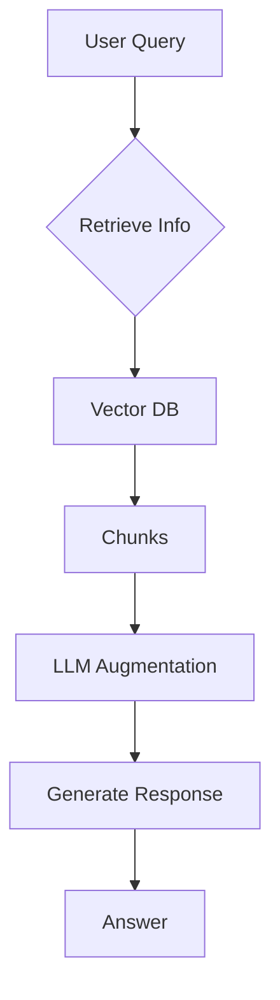
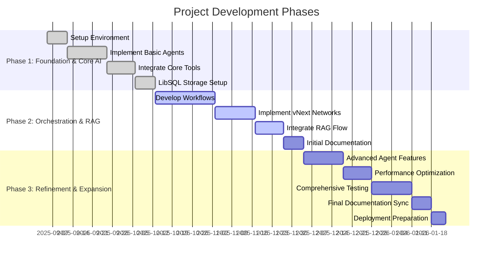
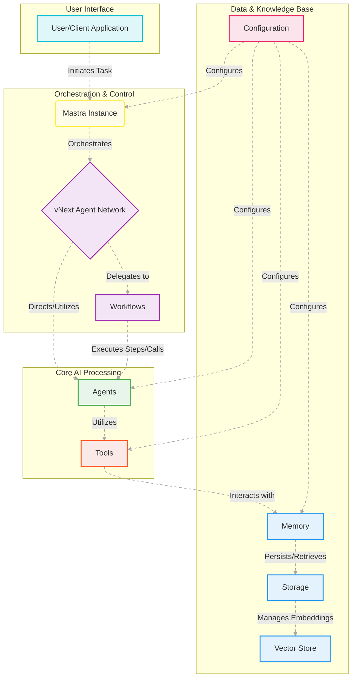

<div align="center">
  <a href="https://github.com/your-username/your-repo-name">
    <!-- Custom SVG Project Logo -->
    <svg width="180" height="180" viewBox="0 0 100 100" role="img" aria-labelledby="logo-title logo-desc">
      <title id="logo-title">Mastra Deep Research Assistant Logo</title>
      <desc id="logo-desc">An abstract logo representing a network of interconnected nodes within a hexagonal shape, symbolizing intelligent deep research and connection.</desc>
      <defs>
        <linearGradient id="diamondGradient" x1="0%" y1="0%" x2="100%" y2="100%">
          <stop offset="0%" stop-color="#444444" />
          <stop offset="50%" stop-color="#000000" />
          <stop offset="100%" stop-color="#444444" />
        </linearGradient>
      </defs>
      <style>
        .logo-background { fill: #000000; } /* True Black */
        .logo-hexagon { fill: #333333; } /* Dark Gray */
        .logo-central-circle { fill: #FFFFFF; } /* White */
        .logo-nodes { fill: #00FF00; } /* Vibrant Green */
        .logo-lines { stroke: #00FF00; stroke-width: 1.5; } /* Vibrant Green lines */
        .animated-nodes {
          transform-origin: 50% 50%;
          animation: pulse-nodes 2s infinite alternate ease-in-out;
        }
        @keyframes pulse-nodes {
          0% { transform: scale(1); opacity: 1; }
          50% { transform: scale(1.05); opacity: 0.8; }
          100% { transform: scale(1); opacity: 1; }
        }
      </style>
      <rect width="100" height="100" class="logo-background"/>
      <path d="M50 10L90 30V70L50 90L10 70V30L50 10Z" class="logo-hexagon"/>
      <circle cx="50" cy="50" r="20" class="logo-central-circle"/>
      <g class="animated-nodes">
        <path d="M50 25L65 50L50 75L35 50Z" fill="url(#diamondGradient)"/>
        <path d="M50 25L65 50L50 75L35 50Z" stroke="#00FF00" stroke-width="2"/>
        <circle cx="50" cy="30" r="1" class="logo-nodes"/>
        <circle cx="60" cy="50" r="1" class="logo-nodes"/>
        <circle cx="50" cy="70" r="1" class="logo-nodes"/>
        <circle cx="40" cy="50" r="1" class="logo-nodes"/>
        <line x1="50" y1="30" x2="60" y2="50" class="logo-lines"/>
        <line x1="60" y1="50" x2="50" y2="70" class="logo-lines"/>
        <line x1="50" y1="70" x2="40" y2="50" class="logo-lines"/>
        <line x1="40" y1="50" x2="50" y2="30" class="logo-lines"/>
      </g>
    </svg>
  </a>
  <h1>Deep Research Assistant + Graph RAG with Mastra 🚀🧠</h1>

  <p>
    **Beyond Basic Search: Intelligent, Autonomous Research & Reporting**
    <br />
    An cutting-edge, human-in-the-loop AI system designed for advanced deep research, leveraging Mastra's powerful orchestration, agent, and network capabilities.
  </p>

  <!-- Tech Badges -->
  <p>
    
    
    
    
    
    
    
  </p>
</div>

---

<details>
  <summary>Table of Contents 🧭</summary>
  <ol>
    <li><a href="#implementation-architecture-the-brain-behind-the-operation">Implementation Architecture: The Brain Behind the Operation</a></li>
    <li><a href="#key-advantages-why-this-system-excels">Key Advantages: Why This System Excels</a></li>
    <li><a href="#how-retrieval-augmented-generation-rag-works">How Retrieval-Augmented Generation (RAG) Works</a></li>
    <li><a href="#core-components-deep-dive">Core Components: Deep Dive</a></li>
    <li><a href="#quick-start-get-your-research-engine-running">Quick Start: Get Your Research Engine Running!</a></li>
    <li><a href="#implementation-details-for-developers">Implementation Details for Developers</a></li>
    <li><a href="#project-development-timeline">Project Development Timeline</a></li>
    <li><a href="#configuration--dependencies">Configuration & Dependencies</a></li>
    <li><a href="#comprehensive-documentation-dive-deeper">Comprehensive Documentation: Dive Deeper</a></li>
    <li><a href="#system-architecture-at-a-glance">System Architecture at a Glance</a></li>
    <li><a href="#contributing-to-deep-research">Contributing to Deep Research</a></li>
    <li><a href="#license">License</a></li>
    <li><a href="#contact">Contact</a></li>
    <li><a href="#acknowledgments">Acknowledgments</a></li>
  </ol>
</details>

---

## 🔬 Implementation Architecture: The Brain Behind the Operation

The Deep Research Assistant is meticulously crafted on Mastra's modular, scalable architecture, designed for intelligent orchestration and seamless human-AI interaction. It's built to tackle complex research challenges autonomously.

1.  **vNext Agent Network Orchestration 🧠**:
    -   **Dynamic Routing**: The core intelligence, leveraging `NewAgentNetwork` to dynamically select and orchestrate specialized agents and workflows based on task requirements. It acts as a sophisticated, LLM-powered supervisor.
    -   **Adaptive Control**: Provides a flexible, LLM-driven routing layer for complex, multi-stage tasks, adapting in real-time to research findings and user feedback.

2.  **Robust Workflow-Based Architecture ⚙️**:
    -   **Structured Research Flows**: Utilizes `researchWorkflow` to handle the entire research lifecycle, from query formulation to data collection and preliminary analysis.
    -   **Automated Report Generation**: Employs `generateReportWorkflow` to orchestrate iterative research cycles and the meticulous creation of comprehensive reports.
    -   **Human-in-the-Loop Integration**: Designed for seamless human intervention with built-in suspend/resume capabilities, critical approval gates, and iterative refinement loops.

3.  **Specialized Agents & Potent Tools 🛠️**:
    -   **Agents**: Autonomous AI entities, each with a distinct area of expertise (e.g., RAG, web research, summarization, reporting).
    -   **Tools**: Reusable, atomic functions that agents can invoke to perform specific actions (e.g., web search, vector queries, data management).

---

## 🎯 Key Advantages: Why This System Excels

1.  **Intelligent Orchestration with vNext Networks**: The `NewAgentNetwork` dynamically routes tasks, enabling fluid, efficient collaboration between specialized agents and workflows, leading to highly optimized problem-solving. 🚀
2.  **True Human-in-the-Loop Research**: Empowering users to actively guide the research process, validate findings, and refine inquiries at critical junctures, ensuring outputs align perfectly with human intent and expertise. 🧑‍🔬
3.  **Seamless Suspend/Resume Capabilities**: Workflows can intelligently pause at critical junctures, enabling external input, human review, or waiting for external events, then resume effortlessly, maintaining full state persistence across sessions and deployments. ⏳
4.  **Structured & Modular Design**: A clear separation of concerns across `vNext Networks`, `Workflows`, `Agents`, and `Tools` guarantees exceptional maintainability, reusability, and independent upgrade paths, fostering a robust and adaptable system. 🧩
5.  **Unwavering Resilient Operation**: Built-in robust error handling, adaptive retry mechanisms, and intelligent fallback strategies ensure continuous, reliable performance even when external services encounter transient issues or failures. 🛡️

---

## 💡 How Retrieval-Augmented Generation (RAG) Works

Our system leverages **Retrieval-Augmented Generation (RAG)** to provide highly accurate and contextually relevant responses. Instead of relying solely on the LLM's pre-trained knowledge, RAG dynamically retrieves up-to-date information from a vast knowledge base and integrates it into the generation process. This approach minimizes hallucinations and ensures responses are grounded in verifiable data.



*   **User Query**: The process begins with a user's question or request.
*   **Retrieve Relevant Information**: The system performs a semantic search within its vast vector database using the user's query. This retrieves document chunks most relevant to the query.
*   **Vector Database**: Our system utilizes a high-performance vector database to store embeddings of all ingested knowledge (documents, web content, learnings, reports).
*   **Document Chunks**: Relevant sections or "chunks" of documents are retrieved based on their semantic similarity to the query.
*   **LLM Augmentation**: The retrieved document chunks provide real-time, external knowledge to the Large Language Model (LLM). This context "augments" the LLM's understanding, allowing it to generate more informed responses.
*   **Generate Grounded Response**: The LLM synthesizes the retrieved information with its own capabilities to produce a comprehensive and accurate answer.
*   **Answer to User**: The final, grounded response is delivered to the user.

---

## 🔬 Core Components: Deep Dive

This project is powered by a suite of specialized Mastra components working in concert:

### **Agents 🤖**
Autonomous AI entities designed for specific research and analytical tasks. Each agent is a specialized expert, equipped with unique instructions and a set of tools to achieve its objectives.

*   **`ragAgent`**: Specializes in Retrieval-Augmented Generation (RAG), seamlessly blending internal knowledge from vector stores with LLM capabilities for accurate and contextual responses.
*   **`researchAgent`**: Conducts multi-phase web research, intelligently breaking down complex queries, performing targeted web searches via `webSearchTool`, evaluating result relevance with `evaluateResultTool`, and extracting key learnings using `extractLearningsTool`.
*   **`reportAgent`**: An expert in synthesizing complex research data into comprehensive, well-structured, and presentable reports, often leveraging markdown for rich formatting.
*   **`webSummarizationAgent`**: Focuses on optimizing token usage by generating concise and informative summaries of extensive web content, ensuring critical information is retained.
*   **`evaluationAgent`**: Assesses the relevance and quality of search results and extracted information, providing crucial feedback for research refinement.
*   **`learningExtractionAgent`**: Extracts critical insights and generates intelligent follow-up questions from diverse content sources, helping to identify knowledge gaps.

### **Workflows ⚙️**
Orchestrated sequences of steps, enabling complex, multi-stage processes with built-in control flow, error handling, and human-in-the-loop capabilities. Workflows define the blueprint for automated research and reporting.

*   **`researchWorkflow`**: Guides users through an interactive research process, from initial query formulation to data collection and preliminary analysis. It includes suspend/resume points for human feedback and approval.
*   **`generateReportWorkflow`**: Manages the end-to-end process of iterative research and report generation, incorporating user approvals, agent collaboration, and conditional logic to produce final reports.

### **Tools 🔧**
Reusable, atomic functions that agents and workflows can invoke to interact with external systems or perform specific data operations. Tools extend the capabilities of the AI system, connecting it to the real world.

*   **`webSearchTool`**: Performs intelligent web searches using the Exa API, efficiently retrieving and often summarizing web content.
*   **`vectorQueryTool`**: Executes semantic searches and retrieves relevant content from configured vector stores based on query embeddings.
*   **`chunkerTool`**: Provides advanced document chunking across various formats (text, HTML, PDF, etc.), enabling efficient processing for vector embeddings and RAG.
*   **`graphRAGTool`**: Facilitates graph-based Retrieval-Augmented Generation, exploring relationships within structured knowledge graphs.
*   **`rerankTool`**: Optimizes search results by re-ranking them based on multiple relevance criteria, improving the quality of retrieved information.
*   **`dataFileManager`**: Handles file system operations for data input, output, and management, allowing agents to interact with local files.
*   **`webScraperTool`**: Directly extracts and processes content from specified web pages, bypassing search engine summaries for deeper analysis.
*   **`weatherTool`**: Retrieves real-time weather information, useful for context-aware research or scenario planning.
*   **`evaluateResultTool`**: Delegates to `evaluationAgent` to assess the relevance and quality of search results, ensuring high-quality data input.
*   **`extractLearningsTool`**: Delegates to `learningExtractionAgent` to extract key insights and generate follow-up questions from diverse content sources.

---

## 🚀 Quick Start: Get Your Research Engine Running!

```bash
# 📥 Install project dependencies
npm install

# ▶️ Launch the deep research assistant
npm run dev
```

### Interactive Research Flow: Your Guide to Discovery

Follow the intuitive prompts to navigate your research journey:

1.  **Define Your Quest**: Enter your research topic to initiate the process. 🔍
2.  **Review Insights**: Examine the AI-generated research findings and extracted learnings. 📊
3.  **Guide the AI**: Approve the research to proceed, or reject to refine and iterate. 👍👎
4.  **Final Deliverable**: Upon approval, a comprehensive, well-structured report will be meticulously generated and returned as your output. 📜

---

## 🧑‍💻 Implementation Details for Developers

This section provides a deeper dive into the codebase for developers looking to extend, customize, or understand the internals of the Mastra Deep Research Assistant.

### Codebase Structure 📂

The core logic of the project resides in the `src/mastra/` directory, organized into distinct, modular components:

*   **`src/mastra/networks/`**: Contains the `NewAgentNetwork` definitions, responsible for orchestrating the overall flow and routing tasks to the appropriate agents and workflows. This is where the high-level intelligence resides.
*   **`src/mastra/agents/`**: Houses the specialized AI agents, each designed for a specific task (e.g., `ragAgent`, `researchAgent`, `reportAgent`). Each agent is a self-contained unit with its instructions, model configuration, and tools.
*   **`src/mastra/workflows/`**: Defines the automated processes and multi-step operations (e.g., `researchWorkflow`, `generateReportWorkflow`). These orchestrate sequences of agent and tool calls, often incorporating human-in-the-loop steps.
*   **`src/mastra/tools/`**: Contains reusable utility functions that agents and workflows can invoke. These tools interact with external APIs (like web search) or perform specific data manipulations (like chunking).
*   **`src/mastra/config/`**: Holds configuration files for AI providers (e.g., Google Gemini), storage (LibSQL), and logging.
*   **`src/mastra/mcp/`**: Contains the Model Context Protocol (MCP) server implementation, allowing external clients to interact with Mastra agents, workflows, and tools.

### Extending the System 🚀

Adding new capabilities to the Deep Research Assistant is designed to be straightforward:

*   **Adding a New Agent**:
    1.  Create a new `.ts` file in `src/mastra/agents/`.
    2.  Define a new `Agent` instance, specifying its `name`, `instructions`, `model`, and the `tools` it can use.
    3.  Consider its `memory` configuration: either define it locally (for standalone use) or rely on externally provided memory from a `vNext Network` or workflow.
    4.  **Time Estimate**: Typically **1-3 hours** for a basic agent, plus time for instruction tuning and testing.

*   **Creating a Custom Tool**:
    1.  Create a new `.ts` file in `src/mastra/tools/`.
    2.  Use `createTool` to define its `id`, `description`, `inputSchema`, `outputSchema`, and the `execute` function containing its logic (e.g., API calls, data processing).
    3.  **Time Estimate**: **30 minutes to 2 hours** for a tool interacting with a simple API, more for complex logic.

*   **Developing a New Workflow**:
    1.  Create a new `.ts` file in `src/mastra/workflows/`.
    2.  Use `createWorkflow` to define its `id`, `inputSchema`, `outputSchema`, and chain together `createStep` calls (which can wrap agents or tools) using `.then()`, `.parallel()`, `.branch()`, or looping constructs.
    3.  **Time Estimate**: **2-8 hours** depending on complexity and number of steps/conditional logic.

*   **Integrating into the `vNext Network`**:
    1.  Import your new agent, tool, or workflow into `src/mastra/networks/complexResearchNetwork.ts`.
    2.  Add it to the `agents` or `workflows` object within the `NewAgentNetwork` configuration.
    3.  Update the `instructions` of the `NewAgentNetwork` to describe when and how the new component should be used.
    4.  **Time Estimate**: **15-30 minutes** for integration once the component is ready.

### Testing and Debugging 🐛

*   **Unit Tests**: Individual agents, tools, and workflow steps can be tested in isolation.
*   **Integration Tests**: Test the interactions between agents and tools, or the full execution path of a workflow.
*   **Logging**: Utilize the configured logger (`src/mastra/config/logger.ts`) for detailed insights into execution flow and debugging.
*   **Observability**: Monitor agent and workflow performance using built-in metrics and tracing capabilities.

---

## 🗓️ Project Development Timeline

This Gantt chart illustrates a simplified timeline for the development phases of the Deep Research Assistant, starting from today's date (September 5, 2025).



---

## ⚙️ Configuration & Dependencies

### Required Environment Variables 🔑

Create a `.env` file in the project root with your API keys:

```bash
GOOGLE_GENERATIVE_AI_API_KEY="your-google-api-key" # Essential for AI model inference
EXA_API_KEY="your-exa-api-key"                     # Powers intelligent web search capabilities
```

### Core Project Dependencies 📦

This project relies on the following robust libraries:

-   `@mastra/core`: The foundational framework for Mastra's agent, workflow, and network functionalities.
-   `@ai-sdk/google`: Integrates seamlessly with Google Gemini models for powerful AI capabilities.
-   `exa-js`: Provides an efficient client for the Exa API, enabling advanced web search.
-   `zod`: Ensures data integrity and validation through concise schema definitions.
-   `@mastra/libsql`: Facilitates robust data persistence and vector database operations using LibSQL.

---

## 📚 Comprehensive Documentation: Dive Deeper

Explore the detailed documentation for a profound understanding of the project's internals and advanced functionalities:

*   [**Advanced Mastra Features**](docs/ADVANCED_MASTRA_FEATURES.md) 🌟 - Delve into cutting-edge capabilities like `streamVNext` and advanced memory.
*   [**Agent Implementation Guide**](docs/AGENT_IMPLEMENTATION_GUIDE.md) 🤖 - Learn how to build, configure, and optimize specialized AI agents.
*   [**Agent Memory Best Practices**](docs/AGENT_MEMORY_BEST_PRACTICES.md) 🧠 - Master strategies for effective agent memory management and persistence.
*   [**API Reference**](docs/API_REFERENCE.md) 📖 - A complete guide to all classes, methods, and types in the system.
*   [**Example: Upsert Embeddings & RAG**](docs/Example%20Upsert%20Embeddings%20%20RAG%20%20Mastra%20Docs.md) 📊 - Practical examples for integrating RAG with vector embeddings.
*   [**Future Work Roadmap**](docs/FUTURE_WORK_ROADMAP.md) 🗺️ - Discover planned enhancements and future directions for the project.
*   [**Integration Patterns**](docs/INTEGRATION_PATTERNS.md) 🔗 - Best practices for integrating with external APIs and services.
*   [**MCP Integration**](docs/MCP_INTEGRATION.md) 🤝 - A guide to integrating with the Model Context Protocol.
*   [**Performance Optimization Guide**](docs/PERFORMANCE_OPTIMIZATION.md) ⚡ - Strategies for enhancing system performance and efficiency.
*   [**Project Documentation Overview**](docs/PROJECT_DOCUMENTATION.md) 📝 - A high-level overview of the entire system's architecture and components.
*   [**Storage & Vector Database Guide**](docs/STORAGE_VECTOR_DATABASE.md) 💾 - Deep dive into data persistence and semantic search capabilities.
*   [**Storage in Mastra**](docs/Storage%20in%20Mastra%20%20Mastra%20Docs.md) 🗄️ - General overview of Mastra's storage system.
*   [**Tools Reference Guide**](docs/TOOLS_REFERENCE.md) 🔧 - Comprehensive documentation for all specialized tools.
*   [**Troubleshooting Guide**](docs/TROUBLESHOOTING_GUIDE.md) 🐛 - Common issues and solutions for smooth operation.
*   [**Workflow Implementation Guide**](docs/WORKFLOW_IMPLEMENTATION_GUIDE.md) ⚙️ - Patterns for building robust and scalable workflows.

---

## System Architecture at a Glance 🗺️



---

## Contributing to Deep Research 🤝

We welcome contributions to this project! Whether you're fixing bugs, adding new features, or improving documentation, your efforts are greatly appreciated. Please see our [Contribution Guidelines](CONTRIBUTING.md) for more details.

---

## License 📄

Distributed under the ISC License. See `LICENSE` for more information.

---

## Contact 📧

Have questions, suggestions, or just want to connect?

*   **Email**: [your.email@example.com](mailto:your.email@example.com)
*   **GitHub Issues**: [Open an Issue](https://github.com/your-username/your-repo-name/issues)

---

## Acknowledgments 🙏

This project is built upon the incredible work of the open-source community. We extend our gratitude to:

*   [Mastra Framework](https://www.mastra.ai/)
*   [shields.io](https://shields.io/) for the awesome badges.
*   [othneildrew/Best-README-Template](https://github.com/othneildrew/Best-README-Template) for the excellent README template inspiration.
*   [matiassingers/awesome-readme](https://github.com/matiassingers/awesome-readme) for the curated list of inspiring READMEs.
